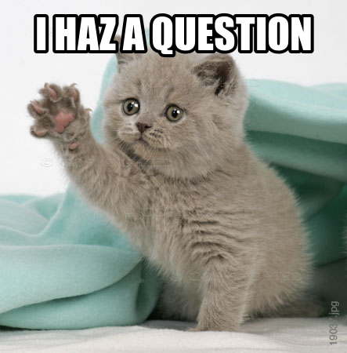

- title : Definitely does compute
- description : History of computing
- author : Andrea Magnorsky
- theme : simple
- transition : default

***
- data-background: images/onikira-poster.png

***

## Andrea Magnorsky

 @SilverSpoon

[roundcrisis.com](http://roundcrisis.com)

* Digital Furnace Games | BatCat Games  
* GameCraft Foundation

And now

***
- data-background : images/phone.jpg
- data-background-size : 1500px

' first interests and computing is about both software and hardware 
# Definitely does compute

### Girl Geek Dinners - December 2015

***

> Computation: study of algorithmic processes that describe the transformation of information

***

' leaving a lot out

***
- data-background: images/hilbert.jpg

## David Hilbert 

' 23 January 1862 – 14 February 1943
' Students: Emmy Noether, Alonzo Church, 
' assistant John Von Neumann (hardware)

---

 >"I do not see that the sex of the candidate is an argument against her admission as a Privatdozent. After all, the university senate is not a bathhouse."

---

> We must know.
> We will know.

--- 

' It all started with a question

---

### Can we device a process to determine in a finite number of operations, whether a first order logic statement is valid?

***
- data-background: images/turing.jpg

## Alan Turing

---

Turing Machine 

' Turing machines, first described by Alan Turing in (Turing 1937), are simple abstract computational devices intended to help investigate the extent and limitations of what can be computed.
' what does it mean a task is computable

***
- data-background: images/church.jpg

## Alonzo Church 

' June 14, 1903 – August 11, 1995

---

λ Calculus

' add good description 

***

Church-Turing Thesis

***
- data-background: images/hopper.jpg

## Grace Hopper

' December 9, 1906 – January 1, 1992

---

## The first compiler: A-0

---

FLOW-MATIC 
' influencial in cobol as a technical consultant

***
- data-background: images/mccarthy.jpg

## John McCarthy

---

## ALGOL , Lisp
' ALGOrithmic Language
' LISt Processing

### AI, time-sharing

***
- data-background: images/history50-70.png
- data-background-size : 1000px

' Algol importance

***

## '50s

* ALGOL
* COBOL
* FORTRAN
* LISP

***
## '60s

* APL
* BASIC
* LOGO
* Smalltalk 

***
## '70s

* ML
* Prolog
* C

***
## '80s

* Erlang
* SQL
* Miranda
* C++ 

***
## '90s

* Haskell

* Delphi
* Java
* Python 
* Ruby
* Visual Basic

***
## '00s

* C#
* Scala
* F#
* Clojure
* D

***
## '10s

* Elixir
* Idris
* Elm

***
- data-background: images/otter-question.jpg

***

## Events and User Groups

* [Functional Kats](http://www.meetup.com/nyc-fsharp/)
* Other user groups about programming languages that have no cats with capes on their logos :D

***
### Thanks :D

- @SilverSpoon
- [roundcrisis.com](roundcrisis.com)

***

### Resources

* [Programming languages: History and future (1972 Jean E. Sammet)](http://www.csee.umbc.edu/courses/undergraduate/331/resources/papers/sammet1972.pdf)
* [Definition of Turing Machines - Standford Encyclopedia of Philosophy](http://plato.stanford.edu/entries/turing-machine/)
* [This has happened before and will happen again - Strange Loop conference recording-  Video ](https://www.youtube.com/watch?v=jmRE5pXFi04)
* [David Hilbert](http://lotsasplainin.blogspot.ie/2007/09/david-hilbert.html)
* [Alan Kay: Computer Applications: A Dynamic Medium for Creative Thought 1972](https://www.youtube.com/watch?v=WJzi9R_55Iw)

---

### Photo credits

* [Phone](https://www.flickr.com/photos/barteko/6127853053)
* "Alonzo Church" by Princeton University. Licensed under Fair use via 
[Wikipedia](https://en.wikipedia.org/wiki/File:Alonzo_Church.jpg#/media/File:Alonzo_Church.jpg)