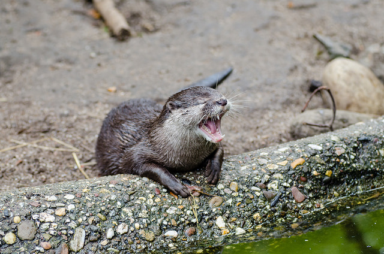

- title : History of programming languages
- description : History of Programming languages
- author : Andrea Magnorsky
- theme : simple
- transition : default


***
- data-background : images/phone.jpg
- data-background-size : 1500px

' first interests and computing is about both software and hardware
## A brief history of programming languages

### Spelunking - January 2016


***
- data-background: images/hilbert.jpg

## David Hilbert

' 23 January 1862 – 14 February 1943
' Students: Emmy Noether, Alonzo Church,
' assistant John Von Neumann (hardware)

---

> We must know.
> We will know.

' repeals the limitation of science

---

' It all started with a question


---

> Can we devise a process to determine in a finite number of operations, whether a first order logic statement is valid?

***
- data-background: images/turing.jpg

## Alan Turing

---

## Turing Machine

' Turing machines, first described by Alan Turing in (Turing 1937), are simple abstract 
' computational devices intended to help investigate the extent and limitations of what can be computed.
' what does it mean a task is computable

***
- data-background: images/church.jpg

## Alonzo Church


' June 14, 1903 – August 11, 1995

---

λ Calculus

' formal system for expressing computation by way of variable binding and substitution
' an expression in λ calculus can be 
' a variable x
' a function λx . x
' function application x  y 

***

## Church-Turing Thesis

***
- data-background: images/ww2.jpg

## Germany during the time of war

***
- data-background: images/hopper.jpg

## Grace Hopper

' December 9, 1906 – January 1, 1992

---

## The first compiler: A-0

---

# FLOW-MATIC
' influencial in cobol as a technical consultant

---

``` 
0) INPUT INVENTORY FILE=A
PRICE FILE=B,
OUTPUT PRICED-INV FILE=C
UNPRICED-INV FILE=D,
HSP D.
1) COMPARE PRODUCT-NO(A) WITH PRODUCT-NO(B)
IF GREATER GO TO OPERATION 10;
IF EQUAL GO TO OPERATION 5;
OTHERWISE GO TO OPERATION 2.
2) TRANSFER A TO D.
3) WRITE ITEM D.
4) JUMP TO OPERATION 8.
5) TRANSFER A TO C.

```

---

```
 6) MOVE UNIT-PRICE(B) TO UNIT-PRICE(C).
 7) WRITE ITEM C.
 8) READ ITEM A; IF END OF DATA GO TO OPERATION 14.
 9) JUMP TO OPERATION 1.
10) READ ITEM B; IF END OF DATA GO TO OPERATION 12.
11) JUMP TO OPERATION 1.
12) SET OPERATION 9 TO GO TO OPERATION 2.
13) JUMP TO OPERATION 2.
14) TEST PRODUCT-NO(B) AGAINST ZZZZZZZZZZZZ;
 IF EQUAL GO TO OPERATION 16;
 OTHERWISE GO TO OPERATION 15.
15) REWIND B.
16) CLOSE-OUT FILES C, D.
17) STOP. (END)
```
***
- data-background: images/backus.jpg

## John Backus

' add some Fortran here

---

## Speedcoding


***
- data-background: images/mccarthy.jpg

## John McCarthy

---

## ALGOL , Lisp
' ALGOrithmic Language
' LISt Processing

## AI, time-sharing


***
- data-background: images/history50-70.png
- data-background-size : 900px

' Algol importance

***

## '50s

* ALGOL (58)
* COBOL (59)
* FORTRAN (57)
* LISP (59)

---
## LISP

```
(defun sieve-of-eratosthenes (maximum)
  (loop
     with sieve = (make-array (1+ maximum)
                              :element-type 'bit
                              :initial-element 0)
     for candidate from 2 to maximum
     when (zerop (bit sieve candidate))
     collect candidate
     and do (loop for composite from (expt candidate 2) 
               to maximum by candidate
               do (setf (bit sieve composite) 1))))
```   


***
## '60s

* APL (62)
* BASIC (64)
* LOGO (67) 
* Pascal (69)


' APL 1962 functional
' BASIC 1964 - 
' LOGO 1967 functional
' Pascal 69 - Wirth

---
### APL


 $ (\sim T \in T \circ.×T)/T←1 \downarrow ⍳R $

' matrix only programming
' evaluates right to left
' automatically creates vectors and arrays
' many primitives for algebra calculation
' makes you think differently about program and data structure'


***
## '70s

* Smalltalk  (72)
* ML (73)
* Prolog (72)
* C (72)

---

### Prolog


```
mother_child(trude, sally).
 
father_child(tom, sally).
father_child(tom, erica).
father_child(mike, tom).
 
sibling(X, Y)      :- parent_child(Z, X), parent_child(Z, Y).
 
parent_child(X, Y) :- father_child(X, Y).
parent_child(X, Y) :- mother_child(X, Y).
```

***

## '80s

* Erlang (86)
* SQL (83)
* Miranda (85)
* C++ (83)

---

###Erlang

```
-module(mymath).
-export([square/1,fib/1]).

square(Value) -> Value*Value.

fib(0) -> 0;
fib(1) -> 1;
fib(N) when N>1 -> fib(N-1) + fib(N-2).
```

***
## '90s

* Haskell (90)
* Delphi (95)
* Java (95)
* Ruby (95)
* Visual Basic (91)
* Javascript (95)

---

## Javascript

```
function factorial(n) {
    if (n == 0) {
        return 1;
    }
    return n * factorial(n - 1);
}
```


***
## '00s

* C# (00)
* Scala (04)
* F# (05)
* Clojure (07)
* D (01)

---

## D

```
ulong factorial(ulong n)
{
    if (n<2)
        return 1;
    else
        return n * factorial(n-1);
}
```

***
## '10s

* Elixir (12)
* Idris (12)
* Elm (12)
* Rust (10)
* Pony (14)

---

## Idris 

```
data Vect : Nat -> Type -> Type where
  Nil  : Vect 0 a
  (::) : (x : a) -> (xs : Vect n a) -> Vect (n + 1) a

total
append : Vect n a -> Vect m a -> Vect (n + m) a
append Nil       ys = ys
append (x :: xs) ys = x :: append xs ys

```


***
- data-background: images/influences.jpg
- data-background-size : 900px

***

> We must know. We Will know


***
### Thanks :D



- @SilverSpoon
- [roundcrisis.com](roundcrisis.com)

***

## Events and User Groups


* [Functional Kats](http://www.meetup.com/nyc-fsharp/)
* Other user groups about programming languages that have no cats with capes on their logos :D


***

### Resources

* [Programming languages: History and future (1972 Jean E. Sammet)](http://www.csee.umbc.edu/courses/undergraduate/331/resources/papers/sammet1972.pdf)
* [Definition of Turing Machines - Standford Encyclopedia of Philosophy](http://plato.stanford.edu/entries/turing-machine/)
* [This has happened before and will happen again - Strange Loop conference recording-  Video ](https://www.youtube.com/watch?v=jmRE5pXFi04)
* [David Hilbert](http://lotsasplainin.blogspot.ie/2007/09/david-hilbert.html)
* [Alan Kay: Computer Applications: A Dynamic Medium for Creative Thought 1972](https://www.youtube.com/watch?v=WJzi9R_55Iw)
* [The APL Programming Language Source Code](http://www.computerhistory.org/atchm/the-apl-programming-language-source-code/)

---

### Photo credits

* [Phone](https://www.flickr.com/photos/barteko/6127853053)
* "Alonzo Church" by Princeton University. Licensed under Fair use via
[Wikipedia](https://en.wikipedia.org/wiki/File:Alonzo_Church.jpg#/media/File:Alonzo_Church.jpg)
