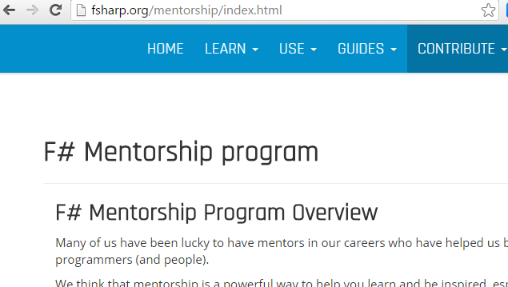

- title : Unfrying your brain with F\#
- description : A talk about some more advanced features of F\#
- author : Andrea Magnorsky
- theme : solarized
- transition : default

***
- data-background : images/roundcrisis.png
- data-background-size : 800px


' thanks for coming to my talk :D
' thanks to Amanda and QCon for inviting me

***


## F# Mentorship Programe


---
## fsharp.org/mentorships



' online one to one mentorship
' 8 weeks
' a goal they define

***
- data-background : images/egg.jpg
- data-background-size : 1500px

## Unfrying your brain with F\#

### QCon London - March 2016

***
- data-background : images/onikira-poster.png


## Killing demons for fun and profit

***
- data-background : images/oni1.png

' portion of the game in F#
' we started uptaking in build, tests
' and then scripting

***
- data-background : images/oni2.jpg


***

## Obvious code is good code.

' don't make it about familiarity
' it is easy to consume F# code from C# ( even F# specific features)
' there are very simple ways to deal with the


***
## F# is a general purpose language.

' cross platofrm
' Functional first


***


***
## Interop


```fsharp
type Order =
  | GoldOrder
  | PlatinumOrder of string

  member this.OrderInfo =
    match this with
    | GoldOrder -> ""
    | PlatinumOrder(extraInfo ) -> "A foamy latte"

```    


***
## Pattern matching

    let openFile (filePath) =
      match filePath with
      | path when
          Path.GetExtension(path) = ".txt" ||
          Path.GetExtension(path) = ".md" ->
                      openText path
      | path when
          Path.GetExtension(path) = ".jpg" ||
          Path.GetExtension(path) = ".png" ||
          Path.GetExtension(path) = ".gif" -> openText path

      | _ -> "oh noes"

---

## Too many when guards


---

### Active patterns

' pattern matching -> against literal values
' AP -> less when guards, match agains elements of a string | collection

    let (|Extension|) (path: string) =
       Path.GetExtension <| path.ToLower()

    let openFile' path =
     match path with
     | Extension ".png"
     | Extension ".jpg"
     | Extension ".gif" -> openPictures path
     | Extension ".txt"   
     | Extension ".md" -> openText path
     | _ -> "oh noes"

---
## Active patterns

* Should not be expensive or cause side effects.
* You can
    * Use them outside of a match expression
    * Pass parameters
    * Nest them and combine them

' Active patterns without pattern matching, because every let binding and parameter
' is a pattern match

---
## (| Bannana Operator |)


***


***

## Type Providers

' does not necessarily contain any types itself; it is a component for generating
' descriptions of types, methods and their implementations.

* Get data from diverse sources and generate types for them.
* Use type providers to:
      * Write to databases
      * Run other languages like R or python
      * Choose your own adventure

' You might be thinking, well I can codegen that however type providers provider a simpler
'  process, (less potential errors, no extra tools). They also tend to scale better (think of ' something huge like Freebase)

***

## Asynchronous Workflows

' Asynchronous? Is something that started, and will execute on the background and terminate later
' Can use tasks

' No callbacks :D

* Inspired async await in C#
* Great for IO bound operations (not cpu bound, use TPL lib)
* Avoid blocking threads
* Cancellation is easier

***

## Computation expressions

* Perfect for some heavy lifting behind the scenes
* let! do! all operation with bang are implemented using CPS. Declared in a `Builder` (A builder is a type that has certain methods implemented)
* Think of the importance of the signature of the functions Bind, Return, etc.
* Given the signature of the functions, we can combine them

***

## Compiler Serivices

* Slow monolith? why not use a plug in architecture and compile code on the fly

***
## Lessons learned

*  F# as a developer best friend becomes evident in the space between
absolute purity and OO, closer to FP
* F#

***

### Thanks :D


- @SilverSpoon
- [roundcrisis.com](roundcrisis.com)

***

## Events and User Groups


* [Functional Kats](http://www.meetup.com/nyc-fsharp/)
* [F#unctional Londoners meetup group](http://www.meetup.com/FSharpLondon/)
* Other user groups about programming languages that have no cats with capes on their logos :D

***

### Resources

* [Extensible Pattern Matching Via a Lightweight Language Extension](http://blogs.msdn.com/b/dsyme/archive/2007/04/07/draft-paper-on-f-active-patterns.aspx)
* [Active Patterns Series: Pattern Matching- Richard Dalton](http://www.devjoy.com/series/active-patterns/)
* [Interesting active patterns - Luke ](http://luketopia.net/2014/09/11/interesting-active-patterns/)
* [Using F# active patterns with Linq](http://langexplr.blogspot.ie/2007/05/using-f-active-patterns-with-linq.html)
* [Denatured proteins rescued by trio of chaperones](http://www.uchospitals.edu/news/1998/19980710-hsp104.html)
* [F# usage survey](https://docs.google.com/forms/d/1Ly_W1ZUH3x_ph4H6I_64uvEib2brDx34j-FoaZkeYLI/viewanalytics)


<script>
  (function(i,s,o,g,r,a,m){i['GoogleAnalyticsObject']=r;i[r]=i[r]||function(){
  (i[r].q=i[r].q||[]).push(arguments)},i[r].l=1*new Date();a=s.createElement(o),
  m=s.getElementsByTagName(o)[0];a.async=1;a.src=g;m.parentNode.insertBefore(a,m)
  })(window,document,'script','//www.google-analytics.com/analytics.js','ga');

  ga('create', 'UA-46761189-1', 'auto');
  ga('send', 'pageview');

</script>
