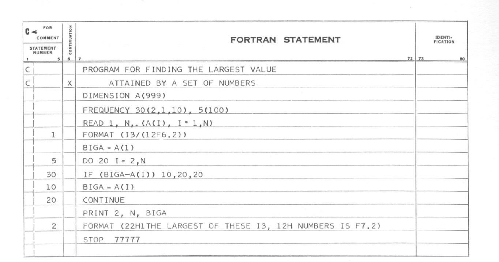

- title : History of programming languages
- description : History of Programming languages
- author : Andrea Magnorsky
- theme : simple
- transition : default


***
- data-background : images/roundcrisis.jpg
- data-background-size : 600px

---

# You should know that

---

# Let's learn that

***


### Andrea Magnorsky

## Curry On Rome

#### Thanks to


***
- data-background : images/history.png
- data-background-size : 1500px


## A brief (and incomplete) history of programming languages

### Curry On Rome - July 2016


***
- data-background: images/hilbert.jpg

## David Hilbert

' Invariant theory and the axiomatization of geometry.
' foundations of mathematics
' 23 January 1862 – 14 February 1943
' interesting social circle: Emmy Noether, Alonzo Church, Haskell Curry
' assistant John Von Neumann

---

> We must know.
> We will know.

' repeals the limitation of science
' Emil du Bois Reymond
' "we do not know and will not know", stood for a position on the limits of scientific knowledge

---


---

> Can we devise a process to determine in a finite number of operations, whether a first order logic statement is valid?

***
- data-background: images/godel.jpg

### Nope

---

## Kurt Gödel

' with Aristotle and Frege one of the most significant logicians

***
- data-background: images/church.jpg

## Alonzo Church


' June 14, 1903 – August 11, 1995

---

## λ Calculus

' formal system for expressing computation by way of variable binding and substitution
' An expression in λ calculus can be :
' a variable x
' a function λx . x
' function application x  y

***
- data-background: images/turing.jpg

## Alan Turing

---

## Turing Machine

' Turing machines, first described by Alan Turing in (Turing 1937), are simple abstract
' computational devices intended to help investigate the extent and limitations of what can be computed.

[sauce](http://aturingmachine.com/)


***

## Church-Turing Thesis


' If a problem can be solved by one system, then it can be solved in another, and vice-versa.

***
- data-background: images/ww2.jpg

## World war II

***
- data-background: images/hopper.jpg

## Grace Hopper

' December 9, 1906 – January 1, 1992

---

## The first compiler: A-0

---

# FLOW-MATIC
' influencial in cobol as a technical consultant

---

```
0) INPUT INVENTORY FILE=A
PRICE FILE=B,
OUTPUT PRICED-INV FILE=C
UNPRICED-INV FILE=D,
HSP D.
1) COMPARE PRODUCT-NO(A) WITH PRODUCT-NO(B)
IF GREATER GO TO OPERATION 10;
IF EQUAL GO TO OPERATION 5;
OTHERWISE GO TO OPERATION 2.
2) TRANSFER A TO D.
3) WRITE ITEM D.
4) JUMP TO OPERATION 8.
5) TRANSFER A TO C.

```

---

```
 6) MOVE UNIT-PRICE(B) TO UNIT-PRICE(C).
 7) WRITE ITEM C.
 8) READ ITEM A; IF END OF DATA GO TO OPERATION 14.
 9) JUMP TO OPERATION 1.
10) READ ITEM B; IF END OF DATA GO TO OPERATION 12.
11) JUMP TO OPERATION 1.
12) SET OPERATION 9 TO GO TO OPERATION 2.
13) JUMP TO OPERATION 2.
14) TEST PRODUCT-NO(B) AGAINST ZZZZZZZZZZZZ;
 IF EQUAL GO TO OPERATION 16;
 OTHERWISE GO TO OPERATION 15.
15) REWIND B.
16) CLOSE-OUT FILES C, D.
17) STOP. (END)
```
***
- data-background: images/backus.jpg

## John Backus

' add some Fortran here

---

## Speedcoding
## BNF

' BNF: formal definition of a language

---



***
- data-background: images/mccarthy.jpg

## John McCarthy

---

## Lisp
' ALGOrithmic Language
' LISt Processing

## AI, time-sharing


***
- data-background: images/algol.png


##ALGOL

' John McCarthy (LISP), Fritz Bauer, Joe Wegstein (COBOL).
' John Backus (FORTRAN), Peter Naur, Alan Perlis

***
- data-background: images/history50-70.png
- data-background-size : 900px

' Algol influence
' So much more activity

***

## '50s

* ALGOL (58)
* COBOL (59)
* FORTRAN (57)
* LISP (59)

' Influential "family" ALGOL

---
## LISP

```
(defun is-prime (n)
  (cond ((= 2 n) t)
        ((= 3 n) t)
        ((evenp n) nil)
        (t
           (loop for i from 3 to (isqrt n) by 2
                 never (zerop (mod n i))))))
```

***
## '60s

* APL (62)
* BASIC (64)
* LOGO (67)
* Pascal (69)

' Influential family ISWIM (66)

' APL 1962 functional , based on maths
' BASIC 1964 - programming for the masses, first? educational languge
' LOGO 1967 functional also about learning
' Pascal 69 - Wirth , the popularity wars begin

---
### APL


 $ (\sim T \in T \circ.×T)/T←1 \downarrow \iota R $

' matrix only programming
' evaluates right to left
' automatically creates vectors and arrays
' many primitives for algebra calculation
' makes you think differently about program and data structure
' 1 Select the highest number in desired range, and assign to R
' 2 Generate vector of all integers 1 thru R [iota function]
' 3 Drop first element from the vector (drop: 1, [down arrow function]
' 4 Set R to the vector  [left arrow function]
' 5 Generate "outer product" of R multiplied by R
' 6 Build a vector the same length as R, but with 1 in each place where the corresponding number in R is in the table [true=1], and 0 where the corresponding number is not [false=0] (0, 0, 1, 0, 1). [set inclusion function]
' 7 Logically negate the values in the vector (change zeros to ones and ones to zeros) (1, 1, 0, 1, 0). [negation function]
' 8 Select the items in R, for which the corresponding element in vector from #7 is one (2, 3, 5). [slash function, evaluated now due to parentheses] -- Done!


***
## '70s

* Smalltalk  (72)
* ML (73)
* Prolog (72)
* C (72)

' influential family: ML?
' Influential: Smalltalk, C


---

### Prolog


```
mother_child(trude, sally).

father_child(tom, sally).
father_child(tom, erica).
father_child(mike, tom).

sibling(X, Y) :- parent_child(Z, X), parent_child(Z, Y).

parent_child(X, Y) :- father_child(X, Y).
parent_child(X, Y) :- mother_child(X, Y).

```

***

## '80s

* Erlang (86)
* SQL (83)
* Miranda (85)
* C++ (83)
* Perl (87)

---

###Erlang

```
-module(mymath).
-export([square/1,fib/1]).

square(Value) -> Value*Value.

fib(0) -> 0;
fib(1) -> 1;
fib(N) when N>1 -> fib(N-1) + fib(N-2).
```

***
## '90s

* Haskell (90)
* Ruby (95)
* Python(91)
* Delphi (95)
* Java (95)
* Visual Basic (91)
* Javascript (95)

---

## Javascript

```
function factorial(n) {
    if (n == 0) {
        return 1;
    }
    return n * factorial(n - 1);
}

```


***
## '00s

* C# (00)
* Scala (04)
* F# (05)
* Clojure (07)
* D (01)
* Go(07)

---

## D

```
void Quack(Animal)(Animal a)
    if( __traits(compiles, a.Quack()))
{
    a.Quack();        
}

struct Duck { void Quack(){ "Quack".writeln; }}

int main(string[] argv) {
    Duck d;
    Quack(d); // good
    Quack(5); // compile time error
}

```

'  if there before the body of the function is a template constraint, is using one of Ds weird features
'  traits(compiles, code)  the compiler will check to see if the code you write there is compilable with
' the type that was passed in, if it cannot compile it then it breaks during compilation


***
## '10s

* Elixir (12)
* Elm (12)
* Rust (10)
* Pony (14)
* Idris (12)

---

## Idris

```
data Vect : Nat -> Type -> Type where
  Nil  : Vect 0 a
  (::) : (x : a) -> (xs : Vect n a) -> Vect (n + 1) a

total
append : Vect n a -> Vect m a -> Vect (n + m) a
append Nil       ys = ys
append (x :: xs) ys = x :: append xs ys

```


***
- data-background: images/programming-languges-graph.png
- data-background-size : 800px

***


***
<div style="border: 0px; overflow: hidden; max-width: 800px; max-height: 600;">
<iframe scrolling="no" src="http://exploringdata.github.io/vis/programming-languages-influence-network" style="border: 0px none; margin-left: -85px; height: 700px; margin-top: -33px; width: 926px;">
</iframe>
</div>

***

' generally people comment on popularity of languages
' funding for the programming languges, lets find trends
' the trend seems to go the way of funcitional non pure functional languages
' there is an obvious need for system languges, that has been generally filled by
' languages created by teams with little or no structured care for pl  theory (C, go ) // is this fair?
' but a lot of focus on the hardware

' we all heard it before, "getting shit done" vs "thinking about it"
' heroes vs people that don't get recognized because noone noticed that the thing was working correctly only because someone
' took a lot of time trying to figure out how to make sure that the thing was working right
' ksksk

***

> We must know. We Will know


***
### Thanks :D


- @SilverSpoon
- [roundcrisis.com](roundcrisis.com)

***

### A non exhaustive list of the Resources

* [Programming languages: History and future (1972 Jean E. Sammet)](http://www.csee.umbc.edu/courses/undergraduate/331/resources/papers/sammet1972.pdf)
* [Definition of Turing Machines - Standford Encyclopedia of Philosophy](http://plato.stanford.edu/entries/turing-machine/)
* [This has happened before and will happen again - Strange Loop conference recording-  Video ](https://www.youtube.com/watch?v=jmRE5pXFi04)
* [David Hilbert](http://lotsasplainin.blogspot.ie/2007/09/david-hilbert.html)
* [Alan Kay: Computer Applications: A Dynamic Medium for Creative Thought 1972](https://www.youtube.com/watch?v=WJzi9R_55Iw)
* [The APL Programming Language Source Code](http://www.computerhistory.org/atchm/the-apl-programming-language-source-code/)
* [Roots of computer languages through the ages](http://www.digibarn.com/collections/posters/tongues/ComputerLanguagesChart.png)
* [Principal programming paradigms](https://www.info.ucl.ac.be/~pvr/paradigmsDIAGRAMeng108.jpg)

---

* [Some History of Functional Programming Languages - D. A. Turner](https://www.cs.kent.ac.uk/people/staff/dat/tfp12/tfp12.pdf)
* [Visualizing influence relations of programming languages](http://exploringdata.github.io/info/programming-languages-influence-network/)
* [Freebase programming language collection](http://www.freebase.com/view/computer/programming_language)
* [Turing on computable numbers](http://swizec.com/blog/week-1-turings-on-computable-numbers/swizec/6375)
* [A Programming Language](http://www.users.cloud9.net/~bradmcc/APL.html)

---

### Photo credits

* [history main starting the talk](http://rigaux.org/language-study/diagram.html)
* "Alonzo Church" by Princeton University. Licensed under Fair use via
[Wikipedia](https://en.wikipedia.org/wiki/File:Alonzo_Church.jpg#/media/File:Alonzo_Church.jpg)
