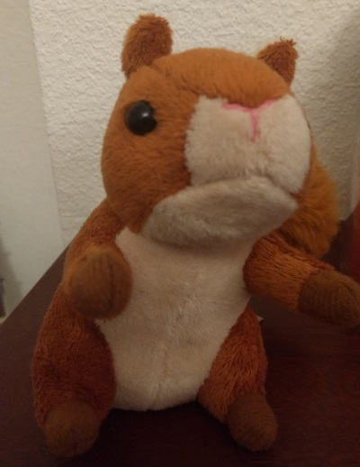
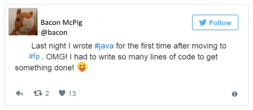

- title : Inviting everyone to the party
- description : A talk about Scala and it's many paradigms
- author : Andrea Magnorsky
- theme : solarized
- transition : default

***
- data-background : images/typelevel.png
- data-background-size : 800px

Thank you 

***
- data-background : images/animalparty.jpg

 
 

## Inviting everyone to the party

###  June 2017

' ... in which we discuss programming paradigms from the perspective of ... ~well, me~.
' there are many programming languages less paradigms
' you see the same  problems appearing in different languges 

***

Disclaimer: 
# CONTEXT 
is really important for most of the assertions here. So please stay in context.

---

## Irish-isms ahead

Craic, eejit, etc are totally ok words
' eejit, craic, and arse are totally irish words

***
- data-background : #AAFF66

' Bacon decided to learn FP, after many years of Imperative and Object Oriented programming

### This is Bacon

---
- data-background : #AAFF66

#### Delphi

#### VB.net

#### C#     (some Js when jQuery was new, some Java)

## F\# / C\#  <- started learning FP woo!

## Scala

---
- data-background : #AAFF66

' 

### Referential transparency 
### less mutable state!!
### No exceptions for flow control!!
###.. and more

' told people this new thing ( I am discovering, but it's not new) is great and how this other silly thing I was using before is subpar (in my case I was comparing F# to C#)
' truly, honestly trying to help,  should have known about thsi stuff before
' and maybe there was all this other people out there , that just needed to hear about it, the way I did.  
' Very soon I started seeing this in other people, and I could relate, but I also started seeing how it sounded like from outside of it

---
- data-background : #AAFF66

### Bacon's friends felt awkward

' the way that sounded to anyone listen is like Bacon was some sort of self centered elitist ivory tower eejit 

---
- data-background : #AAFF66

## Bacon's  FP

* **Typed** FP
* FP everywhere 
* Aspiring to purity / Total functions 

' (but not always achieving it .. why?)
' When dealing with OO aspects use a functional wrapper
' functional wrappers can work but they don't scale and sometimes the performance cost is not acceptable
' how does this evolve?

---
- data-background : #AAFF66

## Problems with FP as Bacon understands it

* Dependency management
* Type tetris
* Complicated concepts 

... is it worth it?... is it the best way?

' Are monad transformers really necessary ?
' surely these problems supported by the language
' that their peers are not groking (choice or not)

---
- data-background : #AAFF66

## Bacon dreams of well structured programs

> Well-structured software is easy to write and to debug, and provides a collection of modules that can be reused
to reduce future programming costs. [Why FP matters. John Hughes]

***
- data-background : #AAFFEE

## Meet Ooooo

---
- data-background : #AAFFEE

* Works with Bacon
* Performance is everything
* Curious about functional approach

' - FP != Typed FP
' - FP definition is loose, in the context of different languages FP means something different to each community 

---
- data-background : #AAFFEE

### "Functional programming has emerged since the mid-2000s as an attractive basis for software construction. One reason is the increasing importance of parallelism and distribution in computing." [Odersky, Rompf April 2014](https://cacm.acm.org/magazines/2014/4/173220-unifying-functional-and-object-oriented-programming-with-scala/fulltext)

'  Its integration of functional and object-oriented concepts leads to a scalable language, in the sense that the same concepts work well for very small, as well as very large, programs.

---
- data-background : #AAFFEE

### "...especially its (Scala) focus on pragmatic choices that unify traditionally disparate programming-language philosophies (such as object-oriented and functional programming) [Odersky, Rompf April 2014](https://cacm.acm.org/magazines/2014/4/173220-unifying-functional-and-object-oriented-programming-with-scala/fulltext)

' this is not what Oooo sees when he talks to Bacon

---
- data-background : #AAFFEE

## SOLID looks a lot like FP when you squint 

' maybe, are these orthogonal concepts?
' but ooo is an owl, do they even squint

***

# On Scala and F#/C# 
(From it's creators)

---

' And then I come to Scala, a language that int he words of Don Syme

>Scala is very much about better component oriented programming for the Java platform. Although we do a good job of object oriented programming which is very nice in F#, we haven't thought to make fundamental improvements at the component level, in a sense. We are quite happy to say "You are making components? OK, make it a .NET component". [Don Syme - March 2009](https://www.infoq.com/interviews/F-Sharp-Don-Syme)

' so, when I read this it was totally a light bulb moment
' F# is designed to be used in conjunction with C#, to do the more OCaml-ey bits Scala is supposed to replace Java

---

> "...[Scala] focus on pragmatic choices that unify traditionally disparate programming-language philosophies (such as object-oriented and functional programming). The key lesson is these philosophies need not be contradictory in practice. 

<small>[Odersky, Rompf - April 2014]</small>

---

> Regarding functional and object-oriented programming, one fundamental choice is where to define pieces of functionality (...) ...and Scala gives programmers the choice. 

> Choice also involves responsibility, and in many cases novice Scala programmers need guidance to develop an intuitive sense of how to structure programs effectively.

<small>[Odersky, Rompf - April 2014]</small>

' last statement at odds with multiparadigm without obstruction for each other?
'  do we need more than one idiom within the language? 

***
- data-background : images/fight.jpg

> When Oooo and Bacon talk, they often disagree and call each other names

' the statements by Syme and Odersky are at odds with the reality of programmers
' what is the impact of this in the systems we create?
' what is the impact of best practises here?
' The way we see paradigms as working programmers perhaps is a little different from academics?

***
- data-background: images/church-turing.jpg

### Doing + thinking
' Turing machine vs lambda calculus
' Practical(?) vs mathematical(?) aproaches to creating languages
' Bright + Alexandrescu -> creting D 
'    mix of practical and acadewmic
' how we solve problems

***

#### We build Systems with:

### language(s)

### tools: libraries, frameworks

### context: users and community 

### Context matters

' because when we assert a thing like FRP is better at GUIs we have a specif context in mind.

***
- data-background : #FFFFFF

* Paradigms and how they interact
* Paradigms and how they shift

  
' same fighs in Scala and  F#/ C# camps

***

## A programming paradigm 

...is an approach to programming a computer based on a mathematical theory or a coherent set of
principles.
<small>[Programming Paradigms for Dummies: What Every Programmer Should Know - Peter Van Roy] </small>
' lets get some proper definitions

---
- data-background : images/paradigms-ctcp.jpg

-

---

>  All but the smallest toy problems require different sets of concepts for different parts. This is why programming languages should support many paradigms.

<small>[Programming Paradigms for Dummies: What Every Programmer Should Know - Peter Van Roy] </small>

' this agrees wit Odersky's statement and Syme statements
' object-oriented programming is best for problems with a large number of related data abstractions organized in a hierarchy

---

> A language should ideally support many concepts in a well-factored way, so that the programmer can choose the right concepts whenever they are needed without being encumbered by the others.

<small>[Programming Paradigms for Dummies: What Every Programmer Should Know - Peter Van Roy] </small>

' called multiparadigm programming, 
' 'in our experience it is clear that it should be the normal way of programming

---
- data-background : images/WAT.jpg

>  ...it is certainly not true that there is one “best” paradigm

<small>[Programming Paradigms for Dummies: What Every Programmer Should Know - Peter Van Roy] </small>

***
- data-background : images/kuhn.jpg

## A paradigm shifts

> "a proliferation of compelling articulations, the willingness to try anything, the expression of explicit discontent, the recourse to philosophy and to debate over fundamentals" 

' the crisis is resolved by a revolutionary change

---
- data-background : #BBBBBB

' yes, we are haivng a funcitonal revolution, it is necesary because the lunch has been over for a while
' a revolution requires the knowledge and the comunity to be ready to receive this new ideas

Many langauges adding features generally associated with functional programming:

* lambdas
* functional data structures
* pattern matching, etc

C++, Java, C# 

' higher abstractions that are easy to grok?  yes, lambdas are coming everywhere Java, C++
' in C# linq has been a major success and this is where RX was born, not as populat but IObservable is part of the BCL 

---
- data-background : #BBBBBB

> The decision to reject one paradigm is always simultaneously the decision to accept another, and the judgment leading to that decision involves the comparison of both paradigms with nature and with each other.

<small>Kuhn, Thomas S.. The Structure of Scientific Revolutions: 50th Anniversary Edition (p. 78). University of Chicago Press. Kindle Edition. </small>

----
- data-background : #BBBBBB

> It is, I think, particularly in periods of acknowledged crisis that scientists have turned to philosophical analysis as a device for unlocking the riddles of their field. Scientists have not generally needed or wanted to be philosophers.

<small> Kuhn, Thomas S.. The Structure of Scientific Revolutions: 50th Anniversary Edition (p. 88). University of Chicago Press. Kindle Edition. 
</small>

---
- data-background : #BBBBBB

' why the choice between competing paradigms regularly raises questions that cannot be resolved by the criteria of normal science.

> "... two scientific schools disagree about what is a problem and what a solution, they will inevitably talk through each other when debating the relative merits of their respective paradigms."

<small>
Kuhn, Thomas S.. The Structure of Scientific Revolutions: 50th Anniversary Edition (p. 109). University of Chicago Press. Kindle Edition. </small> 

' give historical context to the idea that some old stuff 
' that was lurking on the back IPL, FP sudenly got more popular

---
- data-background : #BBBBBB

> "He argued that competing paradigms are "incommensurable": that is to say, there exists no objective way of assessing their relative merits."

<small>
Kuhn, Thomas S.. The Structure of Scientific Revolutions: 50th Anniversary Edition (p. 109). University of Chicago Press. Kindle Edition. </small> 

***
- data-background : images/battlestar.jpg
- data-background-size: 1200px

## All this has happened before and it will happen again

' the way to deal with it is people dying (ratehr than changing their minds?)
' since we are going to be dealing with change often, shouldn't we learn to deal with them better?

***

# As programmers, we

- cut corners
- have religious wars
- deal with terrible code
- deal with other people's terrible code (the wurst!)
- complain about the shortcommings of the current language we are using

' maybe lets use this energy for something else?
' this is not science? or is it? harmony not really a thing
' unite with the Kay  vs Dijstra thing, these things seem at odds but are different view of the same thing... programming 

*** 

1978 Turing Award lecture by Floyd

> To the designer of programming languages, I say: unless you can support the paradigms I use when I program, or at least support my extending your language into one that does support my programming methods, I don't need your shiny new languages; like an old car or house, the old language has limitations that I have learned to live with

---

> To the teacher of programming, even more, I say: identify the paradigms you use, as fully as you can, then teach them explicitly. They will serve your students when Fortran has replaced Latin and Sanskrit as the archetypal dead language.

---

> to the serious programmer: spend a part of your working day examining and refining your own methods. Even though programmers
are always struggling to meet some future or past dead-line, methodological abstraction is a wise long term investment.

*** 
- data-background: images/herding-cats.jpg

.

---
- data-background: images/cats-hats.jpg

' when building software 

### People are part of the context, make them part of your context

---
- data-background: images/flyingcatrtbday.jpg

### Paradigms are shifting, studying the past yields interesting results. 

#### logic programming, assembly code, stack based languages all solve problems in very different ways

' if you begin loking at a problem thinking I got this hammer and I am using it...
' learn assembler, logic programming, lisp, stack based languages, experiences can not be described

---
- data-background: images/herding-cats.jpg

## The party is programming ...everyone is invited.

***
- data-background: images/roundcrisis.jpg
- data-size: 900px

## Thank you

###Andrea Magnorsky

#### @silverspoon

***

### Sources | References

#### papers

* [Programming Paradigms for Dummies: What Every Programmer Should Know - Peter Van Roy](https://www.info.ucl.ac.be/~pvr/VanRoyChapter.pdf)
* [The paradigms of programming](https://pdfs.semanticscholar.org/a57d/cde5113855aec888b2a4e1fdd6e3956ce2e6.pdf)
* [The next 700 programming languages by peter landin](http://www.thecorememory.com/Next_700.pdf)
* [Why Functional Programming Matters by John Hughes](http://www.cse.chalmers.se/~rjmh/Papers/whyfp.html)
* [Joe Armstrong Thesis](http://erlang.org/download/armstrong_thesis_2003.pdf)
 
---
#### articles, posts, videos 

- [A punchcard ate my programme by Walt Mankowski](https://www.youtube.com/watch?v=PF6JEK0BpPU)
- [Clojure spec](https://clojure.org/guides/spec)
- [Lenses in F\#](http://bugsquash.blogspot.co.uk/2011/11/lenses-in-f.html)
- [F# Don Syme](https://www.infoq.com/interviews/F-Sharp-Don-Syme)
- [Programming paradigm](https://en.wikipedia.org/wiki/Programming_paradigm)
- [The expression problem](https://en.wikipedia.org/wiki/Expression_problem)

---

#### Images
- Animal party [link](https://commons.wikimedia.org/wiki/File:Animal_Party.jpg)
- Tea ceremony japan [link](https://commons.wikimedia.org/wiki/Commons:Featured_pictures#/media/File:Japan_tea_ceremony_1165.jpg)
- Cats with hats [link](https://millioninches.wordpress.com/about/)