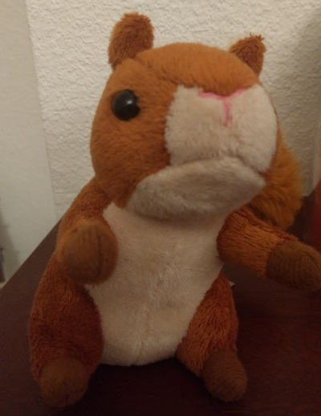
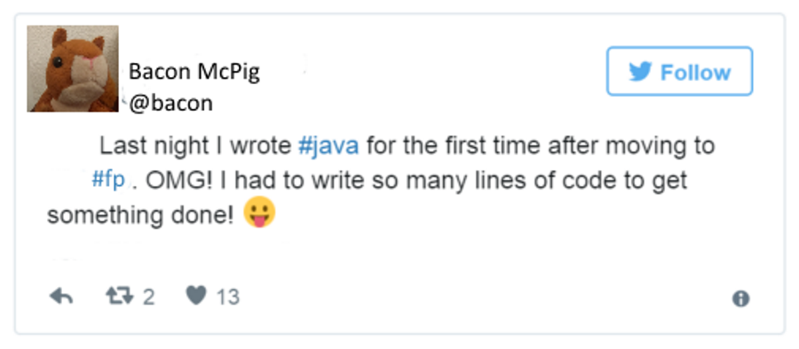
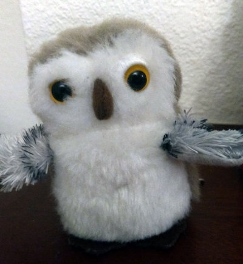
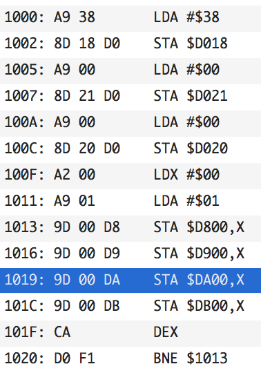

- title : What is next? A friendly guide to choosing your next language
- description : A friendly guide to choosing your next language
- author : Andrea Magnorsky
- theme : solarized
- transition : default

***
- data-background: images/herding-cats.jpg

# Welcome... 

' and thanks for beeing here, for invitng me 

***

 


# What is next?
## (A friendly guide to choosing your next language)

###  December 2017

<div class="footer">
   <small> @silverspoon </small>
</div>

' making a decision ... needs info
' ... in which we discuss programming paradigms
' there are many programming languages less paradigms
' you see the same  problems appearing in different languges 

***

Disclaimer: 


##  ╯°□°）╯︵ ┻━┻

' Don't flip the tables :D
' Context is really important for most of the assertions here.


---

## Irish-isms ahead

### Craic, eejit, etc are totally ok words

* Eejit – an idiot or a fool, but more often it’s used in an affectionate (yet still mocking!) manner.
* Cop on -  common sense
* Give out - complaint

' eejit, craic, and arse are totally irish words

***
- data-background : #AAFF66


' Bacon decided to learn FP, after many years of Imperative and Object Oriented programming

### This is Bacon




---
- data-background : #AAFF66

#### Delphi
<div class="fragment">
#### VB.net
</div>
<div class="fragment">
#### C#     (some Js when jQuery was new, some Java)
</div>

<div class="fragment">

## F\# / C\#
</div>
<div class="fragment">
## Scala
</div>

'  started learning FP woo!

---
- data-background : #AAFF66

' 

### Referential transparency 
### less mutable state!!
### No exceptions for flow control!!
###.. and more

' told people this new thing ( I am discovering, but it's not new) is great and how this other silly thing I was using before is subpar (in my case I was comparing F# to C#)
' truly, honestly trying to help,  should have known about thsi stuff before
' and maybe there was all this other people out there , that just needed to hear about it, the way I did.  
' Very soon I started seeing this in other people, and I could relate, but I also started seeing how it sounded like from outside of it


---
- data-background : #AAFF66

<div class="fragment">
### Bacon's friends felt awkward
</div>



<div class="footer">
   <small> @silverspoon </small>
</div>

' the way that sounded to anyone listen is like Bacon was some sort of self centered elitist ivory tower eejit 

---
- data-background : #AAFF66

## Bacon's  FP

* **Typed** FP
* FP everywhere 
* Aspiring to purity / Total functions 

<div class="footer">
   <small> @silverspoon </small>
</div>

' (but not always achieving it .. why?)
' When dealing with OO aspects use a functional wrapper
' functional wrappers can work but they don't scale and sometimes the performance cost is not acceptable
' how does this evolve?

---
- data-background : #AAFF66

## Problems with FP as Bacon understands it

* Dependency management
* Type tetris
* Complicated concepts 

> ... is it worth it?... is it the best way?

<div class="footer">
   <small> @silverspoon </small>
</div>

' Are monad transformers really necessary ?
' surely these problems supported by the language
' that their peers are not groking (choice or not)


---
- data-background : #AAFF66

## Bacon dreams of well structured programs


> Well-structured software is easy to write and to debug, and provides a collection of modules that can be reused
to reduce future programming costs. [Why FP matters. John Hughes]

<div class="footer">
   <small> @silverspoon </small>
</div>


***
- data-background : #AAFFEE

## Meet Ooooo




---
- data-background : #AAFFEE


* Works with Bacon
* Shipping is everything 
* Curious about functional approach

' - FP != Typed FP
' - FP definition is loose, in the context of different languages FP means something different to each community 


---
- data-background : #AAFFEE

### "Functional programming has emerged since the mid-2000s as an attractive basis for software construction. One reason is the increasing importance of parallelism and distribution in computing." [Odersky, Rompf April 2014](https://cacm.acm.org/magazines/2014/4/173220-unifying-functional-and-object-oriented-programming-with-scala/fulltext)

'  Its integration of functional and object-oriented concepts leads to a scalable language, in the sense that the same concepts work well for very small, as well as very large, programs.

---
- data-background : #AAFFEE

### "...especially its (Scala) focus on pragmatic choices that unify traditionally disparate programming-language philosophies (such as object-oriented and functional programming) [Odersky, Rompf April 2014](https://cacm.acm.org/magazines/2014/4/173220-unifying-functional-and-object-oriented-programming-with-scala/fulltext)

' this is not what Oooo sees when he talks to Bacon

---
- data-background : images/ooo.jpg


## SOLID looks a lot like FP when you squint 

' maybe, are these orthogonal concepts?
' Are these blurry limits the reason for the fights?
' did the designers created these langs with fights in mind, for their hilarity?


***

## From the PL designers


---

>Scala is very much about better component oriented programming for the Java platform. Although we do a good job of object oriented programming which is very nice in F#, we haven't thought to make fundamental improvements at the component level, in a sense. We are quite happy to say "You are making components? OK, make it a .NET component". 
<small>[Don Syme - March 2009](https://www.infoq.com/interviews/F-Sharp-Don-Syme)</small>


' light bulb moment
' F# is designed to be used in conjunction with C#, to do the more OCaml-ey bits Scala is supposed to replace Java


---

> "...[Scala] focus on pragmatic choices that unify traditionally disparate programming-language philosophies (such as object-oriented and functional programming). The key lesson is these philosophies need not be contradictory in practice. 
<small>[Odersky, Rompf - April 2014]</small>


---


> Regarding functional and object-oriented programming, one fundamental choice is where to define pieces of functionality (...) ...and Scala gives programmers the choice. 
<small>[Odersky, Rompf - April 2014]</small>

' do programmers want strong guidance for the language, seeing f# and scala they want neither

---

> Choice also involves responsibility, and in many cases novice Scala programmers need guidance to develop an intuitive sense of how to structure programs effectively.
<small>[Odersky, Rompf - April 2014]</small>


' last statement at odds with multiparadigm without obstruction for each other?
'  do we need more than one idiom within the language? 

***
- data-background : images/fight.jpg


> When Oooo and Bacon talk, they often disagree and call each other names

' the statements by Syme and Odersky are at odds with the reality of programmers
' what is the impact of this in the systems we create?
' what is the impact of best practises here?
' we see paradigms as working programmers perhaps different than academics?


***
- data-background: images/church-turing.jpg

### Doing + thinking

' Turing machine vs lambda calculus
' Practical(?) vs mathematical(?) aproaches to creating languages
' research by doing -> The structure of programming languages recolution , 
' how we solve problems

***

#### We build Systems with:

<div class="fragment">
### language(s)
</div>
<div class="fragment">
### tools: libraries, frameworks
</div>
<div class="fragment">
### context: users and community 
</div>

<div class="fragment">
### Beliefs matter
</div>


' because when we assert a thing like FRP is better at GUIs we have a specif context in mind.


***
- data-background : #FFFFFF


# Paradigms 

' and how they interact
' Paradigms and how they shift
' same fighs in Scala and  F#/ C# camps


***

## A programming paradigm 

>...is an approach to programming a computer based on a mathematical theory or a coherent set of principles.
<small>[Programming Paradigms for Dummies: What Every Programmer Should Know - Peter Van Roy] </small>
' lets get some proper definitions

---
- data-background : images/paradigms-ctcp.jpg
- data-background-size: 800px

---

>  All but the smallest toy problems require different sets of concepts for different parts. This is why programming languages should support many paradigms.<small>[Programming Paradigms for Dummies: What Every Programmer Should Know - Peter Van Roy] </small>

' this agrees wit Odersky's statement and Syme statements
' object-oriented programming is best for problems with a large number of related data abstractions organized in a hierarchy

---

> A language should ideally support many concepts in a well-factored way, so that the programmer can choose the right concepts whenever they are needed without being encumbered by the others.<small>[Programming Paradigms for Dummies: What Every Programmer Should Know - Peter Van Roy] </small>

' called multiparadigm programming, 
' 'in our experience it is clear that it should be the normal way of programming

---
- data-background : images/WAT.jpg

<div class="fragment">
>  ...it is certainly not true that there is one “best” paradigm
<small>[Programming Paradigms for Dummies: What Every Programmer Should Know - Peter Van Roy] </small>

' what is the impact of paradigms in a solution

***

> If the need for pervasive modifications manifests itself, we can take this as a sign that there is a new concept waiting to be discovered. 
<small>[Programming Paradigms for Dummies: What Every Programmer Should Know - Peter Van Roy] </small>


---

### Type inference


```
let myfn bla = 
	if bla = 0 then 0 else 42
```

---

```
// int -> int
let myfn bla = 
	if bla = 0 then 0 else 42
```
---

```
let simpleFuncAst = LAMBDA(ARG "bla",
                    IF(EQUAL(
                        ARG("bla"), INT(0)), 
                        INT(0),
                        INT(42)
                    ))

```

---


---

```
 (Unbound "😺_1" === Unbound "😺_2")
 (Unbound "😺_2" === Bound "INT")
 (Unbound "😺_3" === Bound "BOOL")
 (Unbound "😺_4" === Bound "INT")
 (Unbound "😺_4" === Unbound "😺_6")
 (Unbound "😺_5" === Bound "INT")
 (Unbound "😺_5"=== Unbound "😺_6")
 (Unbound "😺_7" === Unbound "😺_1" -> Unbound "😺_6")

```
---

## Results

   [("😺_2", "INT"); ("😺_3", "BOOL"); ("😺_4", "INT"); ("😺_5", "INT");
     ("😺_1", "INT"); ("😺_6", "INT"); ("😺_7", "INT->INT")]


---

# ASI64 

> Why write 6502 assembly when you can inline it in Racket?

> https://github.com/pezipink/asi64

---

```
(define (clear-screen start character)
  {	ldx @0
        lda @character            
 :loop	(for ([i '(0 1 2 3)])
           {sta (+ start (* i $100)) x})
       	dex
	bne loop-   })
```

---




***
- data-background : images/kuhn.jpg


## A paradigm shifts


> "a proliferation of compelling articulations, the willingness to try anything, the expression of explicit discontent, the recourse to philosophy and to debate over fundamentals" 
<small>Kuhn, Thomas S.. The Structure of Scientific Revolutions. </small>

' the crisis is resolved by a revolutionary change

---
- data-background : #BBBBBB


' a revolution requires the knowledge and the comunity to be ready to receive this new ideas


Many langauges adding features generally associated with functional programming:

* lambdas
* functional data structures
* pattern matching, etc

C++, Java, C# 

' higher abstractions that are easy to grok?  yes, lambdas are coming everywhere Java, C++
' in C# linq has been a major success and this is where RX was born, not as populat but IObservable is part of the BCL 


---
- data-background : #BBBBBB

> The decision to reject one paradigm is always simultaneously the decision to accept another, and the judgment leading to that decision involves the comparison of both paradigms with nature and with each other.
<small>Kuhn, Thomas S.. The Structure of Scientific Revolutions. </small>

----
- data-background : #BBBBBB

> It is, I think, particularly in periods of acknowledged crisis that scientists have turned to philosophical analysis as a device for unlocking the riddles of their field. Scientists have not generally needed or wanted to be philosophers.
<small>Kuhn, Thomas S.. The Structure of Scientific Revolutions. </small>

---
- data-background : #BBBBBB

' why the choice between competing paradigms regularly raises questions that cannot be resolved by the criteria of normal science.


> "... two scientific schools disagree about what is a problem and what a solution, they will inevitably talk through each other when debating the relative merits of their respective paradigms."
<small>Kuhn, Thomas S.. The Structure of Scientific Revolutions. </small>


' give historical context to the idea that some old stuff 
' that was lurking on the back IPL, FP sudenly got more popular

---
- data-background : #BBBBBB


> "He argued that competing paradigms are "incommensurable": that is to say, there exists no objective way of assessing their relative merits."
<small>Kuhn, Thomas S.. The Structure of Scientific Revolutions. </small>

---

# Are we scientists? 
' no (well maybe some of us are)
' delivering software is an activity there is na end goal
' As prorammers we have a somewhat annoying tendency to appropriate terms from other
' places


---

> Almost always the people who achieve these fundamental inventions of a new paradigm have been either very young or very new to the field whose paradigm they change .
<small>Kuhn, Thomas S.. The Structure of Scientific Revolutions. </small> 


' 1) paradigms are about a complete set of fuzzyly defined but large beliefs
' 2) it is possible to have more than one programming paradigm in your brain 
' 3) in kuhns paradigms QUOTE above

' in the case of software, this ideas have generally existed at more or less the same time
' this explains the somewhat strange but valuable comments from floyd


***
- data-background : images/battlestar.jpg
- data-background-size: 1200px


<div class="fragment">

## All this has happened before and it will happen again
</div>

' the way to deal with it is people dying (ratehr than changing their minds?)
' since we are going to be dealing with change often, shouldn't we learn to deal with them better?


*** 
- data-background: images/herding-cats.jpg

.

---
- data-background: images/cats-hats.jpg

' people and their beliefs 

### People are part of the context, make them part of your context

---
- data-background: images/flyingcatrtbday.jpg

### Studying the past yields interesting results. 


' if you begin loking at a problem thinking I got this hammer and I am using it...
' learn assembler, logic programming, lisp, stack based languages, experiences can not be described

---
- data-background: images/herding-cats.jpg

## Changing beliefs is a personal journey.

***

# Thanks to:

### Ross McKinlay
#### Chris Meiklejohn
#### Edwin Brady
#### Juan Manuel Serrano
#### Tomas Petricek
#### and others


***
- data-background: images/roundcrisis.jpg
- data-size: 800px

## Thank you

###Andrea Magnorsky

#### @silverspoon


***

### Sources | References

#### papers

* [Programming Paradigms for Dummies: What Every Programmer Should Know - Peter Van Roy](https://www.info.ucl.ac.be/~pvr/VanRoyChapter.pdf)
* [The paradigms of programming](https://pdfs.semanticscholar.org/a57d/cde5113855aec888b2a4e1fdd6e3956ce2e6.pdf)
* [The next 700 programming languages by Peter Landin](http://www.thecorememory.com/Next_700.pdf)
* [Why Functional Programming Matters by John Hughes](http://www.cse.chalmers.se/~rjmh/Papers/whyfp.html)
* [Joe Armstrong Thesis](http://erlang.org/download/armstrong_thesis_2003.pdf)
 
---
#### articles, posts, videos 

- [A punchcard ate my programme by Walt Mankowski](https://www.youtube.com/watch?v=PF6JEK0BpPU)
- [Clojure spec](https://clojure.org/guides/spec)
- [Lenses in F\#](http://bugsquash.blogspot.co.uk/2011/11/lenses-in-f.html)
- [F# Don Syme](https://www.infoq.com/interviews/F-Sharp-Don-Syme)
- [Programming paradigm](https://en.wikipedia.org/wiki/Programming_paradigm)
- [The expression problem](https://en.wikipedia.org/wiki/Expression_problem)

---

#### Images

- Cats with hats [link](https://millioninches.wordpress.com/about/)