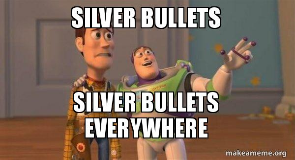

- title : Programming over time
- description : Introduction to React Native with F#
- author : Andrea Magnorsky
- theme : solarized
- transition : default

***

## Programming over time

 

> How writing code has changed and what I wish I'd known

Andrea Magnorsky - [@silverspoon](http://www.twitter.com/silverspoon)

' - history of tooling
' - understanding the problem is essential
' - learning to read code
' - learn the tool you depend on
' - nothing works all the time, context of a solution is everything
' - if your job is boring, have a side project so your brain doesn't rot 

***

### The more things change...

' tooling (learn it)
' programming (learn many well, yes, it takes time)
' scary problems (this gets easier with experience)
' humble

---

### Turbo Pascal 

' An environment/system to do pascal development
' Extremely popular language because 
' good concise high level language, microcomputers
' portability, cheap

---

### Delphi 4

' Next gen Turbo pascal, Delphi, pascal with OO and RAD
' everyone wanted to do desktop 

---

### VB 6.0

' Basic powered up, Basic was a beginner programming language
' very popular

---

### .Net and Java

---

### Such OO Much frameworks

' imperative languages used but OO becoming pervasive in industry
' silver bullets

---
### Popular Java frameworks

---

### The new(?) hotness

### Functional programming

' slowly features generally found on FP languages
' are coming onto mainstream languages
' use of FP first language in industry and mainstream widely accepted

---

***

##  Tooling ⚒

---

## ⚒ Code management

* Before: No source control 
 
' everything done by email/files)

---

## ⚒ Source control

Since then:

* SourceSafe (...)

* subversion

* git | Mercurial

---

## ⚒ Dependency management

* Before: binaries included
* Now: dependencies in public libraries

---

## ⚒  Build and deployment

* Before: "works on my machine" 🙃
* Now: Continuos delivery and deployment 😎

***

## Important Stuff 💯 

<small> a.k.a. Things I wish some told me </small>

---

## Learn to read code.

' you do more reading than writing 
' much learning by reading

* Start somewhere you understand. Then divide and conquer

* Tests, types, etc 👍, documentation and comments can mislead you.

* Tooling: editor that you can navigate, coverage, commit logs, debuggers,etc.

' Start somewhere: you won't understand everything but you need to 
' get an idea, be ready to find that you were wrong
' Tooling: code cov, debbugers, git commit logs, 

---

## Learn to debug code

Not just using a debugger. 

- How does it not work?
- What did you expect vs what happened?
- what are your hidden assumptions?

' Tho it is a good way to start
' understand the program and it's context to be better at debugging
' start thinking of good reasons why stuff doens't work, if you are about to ask a question, can you answer it yourself? 

---
## Nothing works all the time

> Whatever you consider "bad code", at some point is the right solution to a problem.

' leave dogmatic solutions to religion

---

---

---
## Side projects 

* Not mandatory
* You learn so so much
* Don't have to open source it

***

### Takeaways

' - history of tooling

* Understanding the problem is essential
* Learning to read code most useful skill
* Context is the only silver bullet
* Have a side project that you really care about

' - learn the tool you depend on
' - nothing works all the time, context of a solution is everything
' - if your job is boring, have a side project so your brain doesn't rot 

*** 

### Thank you!

Andrea [@silverspoon](@silverspoon)
 

