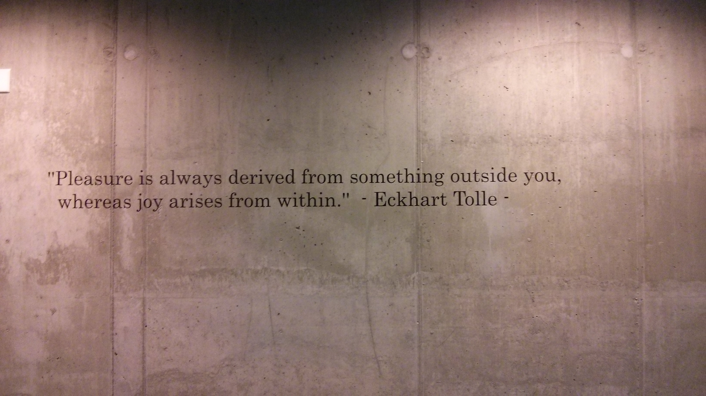

- title : BREAKIN: MAKING A BREAKOUT CLONE IN F#
- description : Making an Breakout clone in F#
- author : Andrea Magnorsky
- theme : solarized
- transition : default

***
## BREAKIN: MAKING A BREAKOUT CLONE IN F#

### Joy of Coding 

---
##  go to [github.com/Andrea/JoyOfCoding2015](https://github.com/Andrea/JoyOfCoding2015)

---

---
### Andrea Magnorsky

- @SilverSpoon 
- [roundcrisis.com](roundcrisis.com)

---

#### OniKira: Demon Killer 

<iframe width="853" height="480" src="//www.youtube.com/embed/8OH31zfRlDs?rel=0" frameborder="0" allowfullscreen></iframe>

***

***

### Game Loop

---

### Entity Component system

* Scenes
* Game Objects
* Components
* Resources

***

* **Like games?** GameJams :)
* [FP AMS](http://www.meetup.com/fp-ams/)
* Kats Conf 15 -  Dublin Sept 12th 

  

***

### Thanks :D

- @SilverSpoon 
- [roundcrisis.com](roundcrisis.com)

