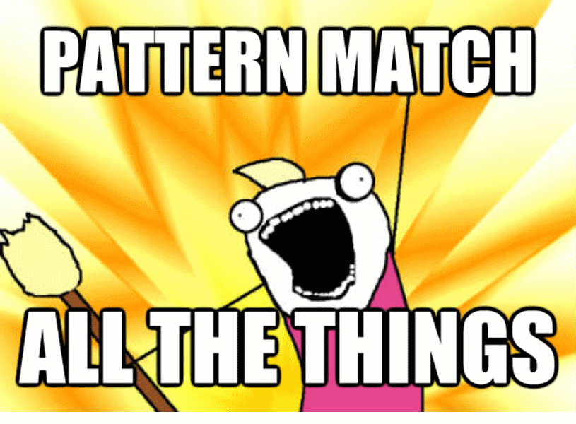

- title : F#, this ain't a game
- description : Using F# and it's ecosystem in production in a game
- author : Andrea Magnorsky
- theme : solarized
- transition : default

***

## F#, this aint a game

### Andrea Magnorsky

Digital Furnace Games ␣ ▀ ␣ BatCat Games ␣ ▀ ␣ GameCraft Foundation

- @SilverSpoon 
- [roundcrisis.com](roundcrisis.com)

---

#### Working on OniKira: Demon Killer 

Available on Steam Early Access

<iframe width="853" height="480" src="//www.youtube.com/embed/8OH31zfRlDs?rel=0" frameborder="0" allowfullscreen></iframe>

---

#### Working on OniKira: Demon Killer 

Available on Steam Early Access

---

***

### Why?

[Out of the tar pit - Mosley, Marks 2006](https://github.com/papers-we-love/papers-we-love/blob/master/design/out-of-the-tar-pit.pdf)

<small>pic src http://en.wikipedia.org/wiki/McKittrick_Tar_Pits </small>

---

### Complexity causes

* State
* Code volume
* Flow of control

---

***

### F# 

* Functional first
* .net Interop
* Concise
* Type system
* OSS
* Divine learning curve

---
### 
<iframe width="1024" height="768" src="//fsharp.org" frameborder="0" allowfullscreen></iframe>

---

    // one-liners
    [1..100] |> List.sum |> printfn "sum=%d"

    // no curly braces, semicolons or parentheses
    let square x = x * x
    let sq = square 42 

    // simple types in one line
    type Person = {First:string; Last:string}

    // complex types in a few lines
    type Employee = 
      | Worker of Person
      | Manager of Employee list

    // type inference
    let jdoe = {First="John";Last="Doe"}
    let worker = Worker jdoe

Visit **F# for Fun and Profit** for more examples

---
#### What we use

---

    match msg with                
    | :? ActorDiedMessage as actorMessage ->                      
        match actorMessage.GameObject.GetComponent<CharacterController>() with 
        | null -> ()
        | characterController -> 
            if ( characterController.IsOnGround() = false ) then 
                PlatformHelper.UnlockAchievement GameAchivement.AirKill
                this.GameObj.GetComponent<ScriptComponent>().DisposeLater()
    | _ -> ()

---

### Active Patterns

They are active because reasons

---

    let (|LeftKey|RightKey|OtherKey|) (keyboard:KeyboardInput) = 
        if keyboard.KeyPressed(Key.Left) then LeftKey
        elif keyboard.KeyPressed(Key.Right) then RightKey
        else OtherKey "Hi, you pressed a key...well that is interesting :D"

    interface ICmpUpdatable with
        member this.OnUpdate()=        
            match DualityApp.Keyboard with            
            | LeftKey  -> playerGo Left
            | RightKey-> playerGo Right
            | OtherKey s-> ()

---

    let (|RightKey|) (keyboard:KeyboardInput) = 
        keyboard.KeyPressed(Key.Right), "Test from right something" 

    let (|LeftKey|) (keyboard:KeyboardInput) = 
        keyboard.KeyPressed(Key.Left)

    let (|Hold100ms|) (keyboard:KeyboardInput) = 
        keyboard.KeyPressedFor(Key.I, 100)

    interface ICmpUpdatable with
        member this.OnUpdate()=        
            match DualityApp.Keyboard with
            | LeftKey true & RightKey (wasPressed, stringy) -> () //the left and not the right
            | LeftKey  -> 
                let leftWall = Scene.Current.FindGameObject("LeftWall")
                if leftWall.Transform.Pos.X + HalfWidth leftWall.RigidBody <= this.GameObj.Transform.Pos.X - HalfWidth this.GameObj.RigidBody  then
                    this.GameObj.Transform.MoveBy(-Vector2.UnitX * 10.0f)                  
            | RightKey->
                 let rightWall = Scene.Current.FindGameObject("RightWall")
                 if (this.GameObj.Transform.Pos.X + HalfWidth this.GameObj.RigidBody <= rightWall.Transform.Pos.X - HalfWidth rightWall.RigidBody) then
               RigidBody ) then
                    this.GameObj.Transform.MoveBy(Vector2.UnitX * 10.0f)
            | OtherKey s-> ()

***
#### Some examples

Light syntax, POCOs 

---

#### C#

    [lang=cs]
    public class Person
    {
        public Person(string name, int age)
        {
            _name = name;
            _age = age;
        }

        private readonly string _name;
        private readonly int _age;

        public string Name
        {
            get { return _name; }
        }

        public int Age
        {
            get { return _age; }
        }
    }

---

#### F# 

    type Person( name:string, age:int) =

    /// Full name
    member person.Name = name

    /// Age in years
    member person.Age = age

---

***

#### Some examples

Testing

---

#### C#

    [lang=cs]
    using NUnit.Framework;

    [TestFixture]
    public class MathTest
    {
        [Test]
        public void TwoPlusTwoShouldEqualFour()
        {
            Assert.AreEqual(2 + 2, 4);
        }
    }

---

#### F# 

    module MathTest =

    open NUnit.Framework

    let [<Test>] ``2 + 2 should equal 4``() =
        Assert.AreEqual(2 + 2, 4)

---
#### FsCheck 

    module MathTest =

    open FsCheck.Nunit

    [<Property>]
    let ``Given a, a + a should equal a * 2`` ( a: int) =
        a + a = 2 * a

You can use FsCheck from F# and C#.

---

***

#### Some examples

C# <-> F# Interop

---

#### C# consuming F# code

Use namespaces in F# or prefix with global::YourModuleName

    [lang=cs]
    using System;
    class Program
    {
        static void Main(string[] args)
        {
            var s = Calculator.Calc.add("4 4", "+");
            Console.WriteLine("The sum is {0}", s);
        }
    }
and the F# side

    namespace Calculator
    module Calc =

        open System
        let add numbers delimiter =    
            // Do stuff to add numbers            

---

#### F# consuming C# code

    module MathTest =

    open NUnit.Framework

    let [<Test>] ``2 + 2 should equal 4``() =
        Assert.AreEqual(2 + 2, 4)

---

***

**Like games?** Dublin GameCraft on the 6th of December @ Microsoft

F# and games workshop from 10am to noon.

**Functional Kats** Monthly meetup 
  

***

### Thanks :D

- @SilverSpoon 
- [roundcrisis.com](roundcrisis.com)

