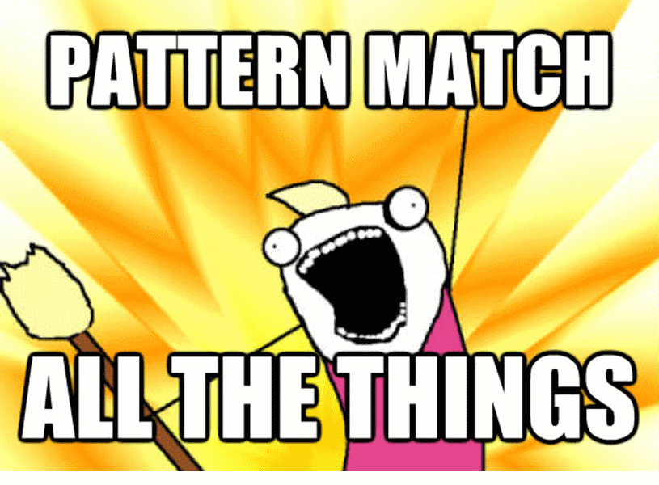

- title : F#, this ain't a game
- description : Using F# and it's ecosystem in production in a game
- author : Andrea Magnorsky
- theme : simple
- transition : default

***

## The tools that shape us

### Andrea Magnorsky @ dev@Lodz 

Digital Furnace Games  ▀  BatCat Games  ▀  GameCraft Foundation

- @SilverSpoon 
- [roundcrisis.com](roundcrisis.com)

---

#### Working on OniKira: Demon Killer 

Available on Steam Early Access

<iframe width="853" height="480" src="//www.youtube.com/embed/8OH31zfRlDs?rel=0" frameborder="0" allowfullscreen></iframe>

---

#### Working on OniKira: Demon Killer 

Steam Early Access

---

***

### Why?

[Out of the tar pit - Mosley, Marks 2006](https://github.com/papers-we-love/papers-we-love/blob/master/design/out-of-the-tar-pit.pdf)

<small>pic src http://en.wikipedia.org/wiki/McKittrick_Tar_Pits </small>

---

### Complexity causes

* State
* Flow of control
* Code volume

---

---

# Simple is hard

---
***
###

<iframe width="800" height="600" src="//www.youtube.com/embed/DN43sCyEanA" frameborder="0" allowfullscreen></iframe>

---
### So we tried F# 

* Functional first
* .net Interop
* Concise
* Type system
* OSS
* Cross platform
* Divine learning curve

---

    // one-liners
    [1..100] |> List.sum |> printfn "sum=%d"

    // no curly braces, semicolons or parentheses
    let square x = x * x
    let sq = square 42 

    // simple types in one line
    type Person = {First:string; Last:string}

    // complex types in a few lines
    type Employee = 
      | Worker of Person
      | Manager of Employee list

    let square x = x * x
    let triple x = x * 3
    let tripleSquared  = square >> triple

Visit **F# for Fun and Profit** for more examples and knowledge

---
#### What we use

---

    let rec fibonacci n =
        match n with
        | 0 -> 0
        | 1 -> 1
        | _ -> fibonacci (n - 1) + fibonacci (n - 2)

---

    let unlockAchievement gameObject achivement=
        match gameObject.GetComponent<CharacterController>() with 
        | null -> ()
        | character -> 
            if (not character.IsOnGround()) then 
                PlatformHelper.UnlockAchievement achivement
                this.GameObj.GetComponent<ScriptComponent>().DisposeLater()

    match msg with                
    | :? ActorDiedMessage as diedMessage -> 
               unlockAchievement diedMessage.GameObj GameAchivement.AirKill
    | _ -> ()

---

### Active Patterns

---

    let (|SpaceKey|) (keyboard:KeyboardInput) = 
        keyboard.KeyPressed(Key.Space)

    let (|Hold100ms|) (keyboard:KeyboardInput) = 
        keyboard.KeyPressedFor(Key.I, 100)  

    match DualityApp.Keyboard with        
    | SpaceKey true & Hold100ms false -> playerGo Jump
    | SpaceKey true & Hold100ms true -> playerGo DoubleJump

---

    let (|LeftKey|RightKey|OtherKey|) (keyboard:KeyboardInput) = 
        if keyboard.KeyPressed(Key.Left) then LeftKey
        elif keyboard.KeyPressed(Key.Right) then RightKey
        else OtherKey "Hi, you pressed a key...well that is interesting :D"

    interface ICmpUpdatable with
        member this.OnUpdate()=        
            match DualityApp.Keyboard with            
            | LeftKey  -> playerGo Left
            | RightKey-> playerGo Right
            | OtherKey s-> ()

---

***

# Interop
<small>Check out the design guidelines</small>

---

#### C# consuming F# code

Use namespaces in F# or prefix with global::YourModuleName

    [lang=cs]
    using System;
    class Program
    {
        static void Main(string[] args)
        {
            var s = Calculator.Calc.add("4 4", "+");
            Console.WriteLine("The sum is {0}", s);
        }
    }
and the F# side

    namespace Calculator
    module Calc =

        open System
        let add numbers delimiter =    
            // Do stuff to add numbers            

---

#### F# consuming C# code

    module MathTest =

    open NUnit.Framework

    let [<Test>] ``2 + 2 should equal 4``() =
        Assert.AreEqual(2 + 2, 4)

---
***

### REPL

#### Now: exploration
#### Future: Live coding

***
### Ecosystem: What we use now

* FsCheck
* Fake
* Compiler Services

---

### Future

* Ferop 
* Paket           

---
***
### Property Testing with FsCheck

>Why write tests, when you can generate them

---

### What is a property?

> x + x = 2 * x 

or

> List.rev(List.rev list) = list

---
### FsCheck

* QuickCheck [paper](http://www.cs.tufts.edu/~nr/cs257/archive/john-hughes/quick.pdf) by Koen Claessen and John Hughes 
* Superb article by Scott Wlaschin on [Property based testing ](http://fsharpforfunandprofit.com/posts/property-based-testing/) ``as part of the F# advent calendar``.
* Can be used from C# 
* Small library
* Can run stand alone or integrates with NUnit and xUnit

---

    [<Property>]
    let ``When adding x to x then result is double x``(x:int)=
        x + x = 2*x

---

    let preconditionMaxHealth maxHealth = maxHealth > 0

    [<Property(Verbose = true)>]    
    let ``Health should never be higher than max`` (x:int)(maxHealth:int)=        
        let healthComponent = initedHealth
        healthComponent.MaxHealth <- maxHealth
        healthComponent.IncreaseHealth x
        preconditionMaxHealth maxHealth ==>  (healthComponent.MaxHealth >= healthComponent.Health)

---

---
***
### Fake

* Use from any .net language
* It's mature.
* Builds for .net and mono, it's cross platform. 
* No need to know F# to use it.
* Integrates with CI Server.

---
### Hello world!

    // include Fake lib
    #r @"tools\FAKE\tools\FakeLib.dll"
    open Fake 
    Target "Foo" (fun _ ->
        trace "Hello World from Foo"
    )
    
    Target "Bar" (fun _ -> 
        trace "Hello World from Bar"
    )
    "Bar"
      ==> "Foo"
    
    RunTargetOrDefault "Foo"

---
### Real world

---
***

## Compiler.Services
    
---
## Duality.Scripting

* File watcher
* Code in any editor :)
* Compiler Services call to fsc
* Future -> live coding

[repo](https://github.com/BraveSirAndrew/DualityScripting)

---

***

## Resources

* [Fsharp.org](http://Fsharp.org)
* Fsharp Koans
* [Tryfsharp.org](http://Tryfsharp.org)
* F# for fun and profit
* Community for F# c4f# 

---

``Books``

* Expert F# 
* Real World Functional programming
* [More Books](http://fsharp.org/about/learning.html)

---

## Events

- F# Exchange (17th April - London)
- NCrafts (21-22 May - Paris)

- User groups 
   

***

### Thanks :D

- @SilverSpoon 
- [roundcrisis.com](roundcrisis.com)

***
### Links

* [Pipe and function composition](http://theburningmonk.com/2011/09/fsharp-pipe-forward-and-pipe-backward/)
* [Why F#](http://fsharpforfunandprofit.com/why-use-fsharp/)
* [Why F# and FP in general](http://www.roundcrisis.com/2014/05/10/why-fsharp/)
* [F# Pattern matching for beginners](http://hestia.typepad.com/flatlander/2010/07/f-pattern-matching-for-beginners-part-6-active-patterns.html)
* [F# Component design](http://fsharp.org/specs/component-design-guidelines/fsharp-design-guidelines-v14.pdf)
* [Duality Scripting](http://www.roundcrisis.com/2014/04/21/Fsharp-scripting-for-the-game-engine/) 

