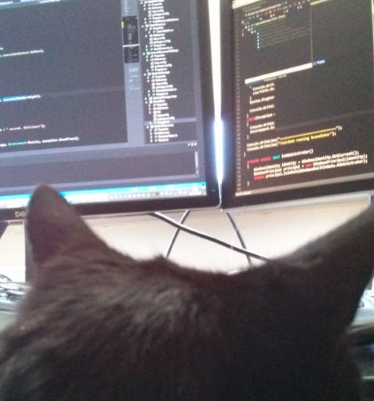

- title : Computation expressions in context
- description : Monoids, monads and computation expressions
- author : Andrea Magnorsky
- theme : night
- transition : default

***
- data-background : images/fsharpT.png
- data-background-size : 900px

## Computation expressions in context : a history of the otter king

### F# Exchange @ SkillsMatter

***

## Andrea Magnorsky 

Digital Furnace Games  ▀  BatCat Games  ▀  GameCraft Foundation

- @SilverSpoon 
- [roundcrisis.com](roundcrisis.com)

---

#### OniKira: Demon Killer 

<iframe width="853" height="480" src="//www.youtube.com/embed/8OH31zfRlDs?rel=0" frameborder="0" allowfullscreen></iframe>

***
- data-background: images/onikira-poster.png

***

###Disclaimer : Some pictures I show here have absolutely nothing to do with what I will be talking about
###so ask questions if confused ;)... it might still make no sense, but that is ok.

***

### Monads 

' I started of doing what I assume most of us do when I heard first about monads, I went and read a couple of posts and learned absolutely nothing about it. 
' Interestingly, the first person to describe monads was Eugenio Moggi, he published a  paper called ["Notions of computation and monads"](http://www.disi.unige.'it/person/MoggiE/ftp/ic91.pdf) this paper is maths heavy tho I am sure some of you will be interested in looking at this.

 

---

' I do remember tho that this other person, Philip Wadler, who made monads popular(?) widely known.

### Comprehending Monads
### Monads for functional programming

' purity vs impurity and how when trying to keep pure certain things become harder than they would be in imperative code
' F# is an impure language
' Pure language: it has referential transparency, so, you can replace any expression with its value without changing the meaning of the program. 
' ss

---

Some ``not-useful-right-away`` info

* There is a strong link between monads and category theory 
* Monads have 3 monadic laws that every monad must satisfy: 
        - Left identity
        - Right identity and 
        - Associativity

---

## Monads eh? talk to the otter king

***

## Monoids

' helped understand monads was to start by trying to understand monoids, the reason for that is that they made me think about program flow  
' why bother?

* Convert pairwise operations into work in collections
* Parallelization and Incrementalism

---

    type Colour = { r: byte; g: byte; b: byte; a: byte }

    let add c1 c2 = {r = c1.r + c2.r ; g = c1.g + c2.g ; b = c1.b+ c2.b; a = c1.a + c2.a }

    let addColours'  (colours: Colour list) =
        //MUTABLE OMG!!
        let mutable res = { r = 0uy; g = 0uy;b = 0uy;a = 0uy}
        for i in colours do
            res <- add res i
        res

---

## Monoids

* Closures  $  a' \rightarrow  a' \rightarrow  a'  $ (example  int -> int -> int   )
* Identity   $ x + I  = x $
* Associativity  $ x + (y + z) = (x + y ) + z $

---

    type Monoid<'a> = 
        { neutral : 'a
          op : 'a -> 'a -> 'a }

---

    let neutral = { r = 0uy; g = 0uy; b = 0uy; a = 0uy }

    let colourAdd : Monoid<Colour> = { 
        neutral = neutral
        op = (addTwo) 
    }

---

    let c1 = { neutral with g = 254uy }
    let c2 = { neutral with r = 254uy }

    let l = [ c1; c2; neutral ]
            |> List.reduce (+++)

---

' This is a typical example of a concept that is general, very useful and just has terrible marketing :D?, the name monoid can be quite  scary  for something 
' simple to think about but hard to express.

' So why are these concepts important, what do they give you?

' Because of closures-> We can convert pairwise operations into operations that work on collections
' Because of associativity -> We can implement divide and conquer algorithms that are great for
'                               Parallelization
'                               Incrementalism
' Because of identity -> we can actually perform certain of the above

' If you have ever done map reduce, then this should feel pretty familiar

---

Oh, yes and you can property check that your type is a monoid!!

    type T = Colour

    let M = colourAdd
    let Z = M.neutral
    let (++) = M.op

    [<Property>]
    let `` Z is the neutral element`` (v : T) = 
        Z ++ v = v && v ++ Z = v

    [<Property>]
    let ``The operation is commutative`` (a : T, b : T, c : T) = 
        a ++ (b ++ c) = (a ++ b ++ c)

---
Enjoy my favourite picture (of myself)

The king will help...

***

> A **monad** is a monoid in the category of endofunctors.

---

> A **monad** is like a burrito.

---

> Think of **monads** just like you would think about Legos.

---

' It all seemed pretty strange to me and I wound up understanding less and less

---
' then I see this in the news!! Is there some sort of link between otters and monads? 

***

' Wadler talked about handling errors in his monad paper, MAYBE we should try to write some code and see how can we use this stuff

## Errors

    let random = new System.Random()
    let division a b c d=
        match b with
        | 0 -> None
        | _ -> match c with
               | 0 -> None
               | _ -> match d with
                      | 0 -> None
                      | _ -> Some (((a/b)/c)/d)

---

    let divide a b =
        match b with
        | 0 -> None
        | _ -> Some (a/b )

---

    type MaybeBuilder() =
        member __.Bind(value, func) =
            match value with
            | Some value -> func value
            | None -> None
        member __.Return value = Some value
        member this.ReturnFrom value = 
            this.Bind(value, this.Return)

---

    let maybe  = MaybeBuilder()

    let divisionM a b c d=
        maybe{
            let! x = divide a b
            let! y = divide x c
            let! z = divide y d
            return z
        }

' what is happening here ?
' Monads apply a function that returns a wrapped value to a wrapped value. Monads have a function >>= (pronounced “bind”) to do this.

---

## lets decompose that a little bit

---

' oh, oh! and you can also property check a monad (tho a little harder to read than the monoids)

    open FsCheck
    open FsCheck.NUnit

    [<Test>]
    let ``monad laws``() =
        let ret (x: int) = choose.Return x
        let n = sprintf "Choice : monad %s"
        let inline (>>=) m f = choose.Bind(m,f)
        fsCheck "left identity" <| 
            fun f a -> ret a >>= f = f a
        fsCheck "right identity" <| 
            fun x -> x >>= ret = x
        fsCheck "associativity" <| 
            fun f g v ->
                let a = (v >>= f) >>= g
                let b = v >>= (fun x -> f x >>= g)
                a = b

---

# Why learn this?

' Because understanding the abstraction and having a common language is worth it

***

## Computation Expressions

> Most monads are computation expressions, not all computation expressions are monads

' you can do more with them 
' Computation expressions reuse the normal syntax of the F# language, so you can write code 
' using standard constructs like let, for and try .. with, but with a ' different semantics,
' functors (using a research extension), monoids, additive monads, computations constructed using monad transformers and more.
' limitations : cant write code that is polimorphic over the type of the computation  (can be done but not idiomatic)
' In Haskell, they are fundamental part of the language and you need them all the time. In F#, they are only used when you actually want to write some concrete 
' computation with non-standard behaviour. 
' syntax matters

---
 
### Computation expressions or workflows

Computation expressions have been available in F# since 2007 and they are fully documented in the [F# language specification][4]

* Abstract computations
* Handling of effects

' monads, monoids, additive monads
' expressions can have effects 

---

## async

    open System

    let sleepWorkflow  = async{
        printfn "Starting sleep workflow at %O" DateTime.Now.TimeOfDay
        do! Async.Sleep 2000
        printfn "Finished sleep workflow at %O" DateTime.Now.TimeOfDay
        }

    Async.RunSynchronously sleepWorkflow      

---

## cloud

    let job =
        cloud { 
            return sprintf "run in the cloud on worker '%s' " Environment.MachineName }
        |> runtime.CreateProcess

---

***

### Resources 

* [Abstraction, intuition, and the “monad tutorial fallacy”](https://byorgey.wordpress.com/2009/01/12/abstraction-intuition-and-the-monad-tutorial-fallacy/)
* [The "What are monads?" fallacy](http://two-wrongs.com/the-what-are-monads-fallacy)
* [Beyond Foundations of F# - Workflows](http://www.infoq.com/articles/pickering-fsharp-workflow)
* [Monads, Arrows and idioms](http://homepages.inf.ed.ac.uk/wadler/topics/monads.html) there is a bunch of papers here.
* [Why a monad is like a writing desk](http://www.infoq.com/presentations/Why-is-a-Monad-Like-a-Writing-Desk) Video 
* [Understanding Monoids][3] F# for fun and profit series on monoids
* [Syntax Matters: Writing abstract computations in F#](http://tomasp.net/academic/papers/computation-zoo/syntax-matters.pdf) paper by Tomas Petricek and Don Syme about computation expressions
* [Monads explained from a maths point of view](https://www.youtube.com/watch?v=9fohXBj2UEI) Video
* [Comprehending Monads][1] P.Wadler paper
* [Monads for functional programming][2] P.Wadler paper
* [F# language specification][4]
* [Try Joinads F# research extension for concurrent, parallel and asynchronous programming.](http://tryjoinads.org/index.html?computations/home.html)
* [Functors Applicatives and monads in pictures](http://adit.io/posts/2013-04-17-functors,_applicatives,_and_monads_in_pictures.html)

[1]:(http://ncatlab.org/nlab/files/WadlerMonads.pdf)
[2]:(http://homepages.inf.ed.ac.uk/wadler/papers/marktoberdorf/baastad.pdf)
[3]:(http://fsharpforfunandprofit.com/posts/monoids-without-tears/#series-toc)
[4]:http://fsharp.org/specs/language-spec/

***

### Thanks :D

- @SilverSpoon 
- [roundcrisis.com](roundcrisis.com)

***